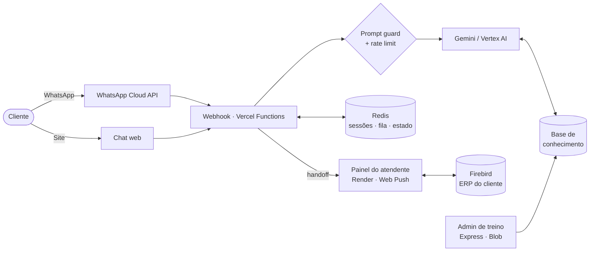

<!-- ═══════════════════════════════  HEADER  ═══════════════════════════════ -->
<div align="center">


<a href="https://www.pedrogarciadev.com.br/">
  
</a>

<br/>

<a href="https://www.pedrogarciadev.com.br/"></a>
<a href="https://www.linkedin.com/in/pedrogarcia-tech"></a>
<a href="https://www.instagram.com/pedrocadev"></a>
<a href="https://www.tiktok.com/@pedrogarciadev"></a>

<br/>


</div>

<br/>

<!-- ═══════════════════════════════  SOBRE  ═══════════════════════════════ -->

## Sobre mim

Sou **desenvolvedor Full Stack** e construo produtos completos — da modelagem do banco e da API até a interface que o usuário toca. Meu trabalho vive no cruzamento entre **engenharia sólida** e **experiência memorável**: sistemas SaaS com autenticação, painéis administrativos, integrações com **WhatsApp e IA generativa** rodando em produção, e front-ends imersivos com **Three.js** e **GSAP**.

```js
// pedro.config.js
export default {
  role:       "Full Stack Developer",
  location:   "Monte Aprazível, SP · remoto",
  frontend:   ["JavaScript", "TypeScript", "HTML/CSS/SCSS", "Three.js", "GSAP"],
  backend:    ["Node.js", "Express", "Python", "FastAPI", "Serverless (Vercel Functions)"],
  data:       ["MongoDB", "PostgreSQL", "Redis", "Firebird"],
  ai:         ["Gemini / Vertex AI", "Groq (Llama + Whisper)", "WhatsApp Cloud API"],
  infra:      ["Docker", "filas com workers (arq)", "Sentry", "GitHub Actions"],
  security:   ["JWT", "bcrypt", "Helmet", "Rate limiting", "Sanitização (XSS / NoSQL injection)"],
  shipping:   ["Vercel", "Render", "Git"],
  mindset:    "produção primeiro: seguro, observável, rápido",
  available:  true,
};
```

<!-- ═══════════════════════════════  O QUE ENTREGO  ═══════════════════════════════ -->

## O que eu entrego

<table>
  <tr>
    <td width="33%" valign="top">
      <h3>Front-end</h3>
      Interfaces responsivas, animadas e rápidas. Cenas 3D em <b>Three.js</b>, scroll storytelling com <b>GSAP ScrollTrigger / SplitText</b> e micro-interações que fazem o produto parecer vivo.
    </td>
    <td width="33%" valign="top">
      <h3>Back-end</h3>
      APIs em <b>Node.js/Express</b> e <b>Python/FastAPI</b>, filas com workers, PostgreSQL e MongoDB, JWT, validação, rate limit, Helmet, upload e processamento de imagem (<b>Multer + Sharp</b>) e logs estruturados (<b>Winston</b>).
    </td>
    <td width="33%" valign="top">
      <h3>IA & Automação</h3>
      Agentes conversacionais no <b>WhatsApp</b> com <b>Gemini</b>, base de conhecimento editável, guarda contra prompt injection e <b>handoff para atendente humano</b> em tempo real.
    </td>
  </tr>
</table>

<!-- ═══════════════════════════════  CASE  ═══════════════════════════════ -->

## Case em produção — Plataforma de atendimento com IA

> Projeto privado para cliente · **em produção** · serverless + painel em tempo real

Assistente virtual que atende clientes no **site e no WhatsApp**, responde com base em conhecimento curado pela equipe e, quando precisa, **transfere a conversa para um atendente humano** — que responde por um painel web com push notification, citação de mensagens, foto e áudio.



<sub>**Destaques de engenharia:** autenticação de sessão própria · proteção contra prompt injection · fila de atendimento com expediente e renovação automática via cron · agrupamento de mensagens em rajada · mídia (foto/áudio) com prazo · observabilidade e verificação de origem.</sub>

<!-- ═══════════════════════════════  PROJETOS  ═══════════════════════════════ -->

## Projetos em destaque

<table>
  <tr>
    <td width="50%" valign="top">
      <h3>SaaS de Cheques</h3>
      Sistema SaaS para gestão e controle de cheques, com interface animada (GSAP) e elementos 3D.
      <br/><br/>
      
      
      
      
      <br/><br/>
      <a href="https://saa-s-cheques.vercel.app">Demo</a> · <a href="https://github.com/pedrogarcialeite04/SaaS-cheques">Código</a>
    </td>
    <td width="50%" valign="top">
      <h3>Museu 3D</h3>
      Museu virtual navegável no navegador: cena WebGL com iluminação, tone mapping ACES e transições cinematográficas.
      <br/><br/>
      
      
      
      
      <br/><br/>
      <a href="https://museupedroca.vercel.app">Demo</a> · <a href="https://github.com/pedrogarcialeite04/museu3d">Código</a>
    </td>
  </tr>
  <tr>
    <td width="50%" valign="top">
      <h3>Plataforma FJR — site + painel + API</h3>
      Produto completo em 3 camadas: landing, painel administrativo e API com JWT em cookie, bcrypt, Helmet, rate limit, sanitização contra XSS/NoSQL injection, upload com Sharp e logs com Winston.
      <br/><br/>
      
      
      
      
      <br/><br/>
      <a href="https://teste-remoto.vercel.app">Site</a> · <a href="https://paineladmfjr.vercel.app">Painel</a> · <a href="https://github.com/pedrogarcialeite04/backend-fjr">API</a>
    </td>
    <td width="50%" valign="top">
      <h3>Assistente Financeiro no WhatsApp</h3>
      Agente que entende <b>texto e áudio</b> (Whisper), registra gastos e receitas e responde com relatórios e alertas de orçamento. Webhook com validação HMAC responde em ms e enfileira; o <b>worker</b> processa com idempotência e lock.
      <br/><br/>
      
      
      
      
      
      <br/><br/>
      <a href="https://github.com/pedrogarcialeite04/bot_whatsapp">Código</a>
    </td>
  </tr>
  <tr>
    <td width="50%" valign="top">
      <h3>Plataforma de Casamento</h3>
      Convite digital + painel administrativo + API serverless de confirmação de presença (RSVP), com token de admin e CORS restrito por origem.
      <br/><br/>
      
      
      
      <br/><br/>
      <a href="https://convite-nu-cyan.vercel.app">Convite</a> · <a href="https://paginaadm-casamento.vercel.app">Admin</a> · <a href="https://github.com/pedrogarcialeite04/backend-casamento">Código</a>
    </td>
    <td width="50%" valign="top">
      <h3>Foco — app de produtividade</h3>
      Aplicação full stack com contas de usuário, autenticação JWT e API protegida com Helmet e rate limiting.
      <br/><br/>
      
      
      
      
      <br/><br/>
      <a href="https://foco-delta.vercel.app">Demo</a> · <a href="https://github.com/pedrogarcialeite04/app-foco">Front</a> · <a href="https://github.com/pedrogarcialeite04/backend-foco">API</a>
    </td>
  </tr>
</table>

<details>
<summary><b>Mais projetos</b></summary>
<br/>

| Projeto | O que é | Stack |
|---|---|---|
| [**PGFlow**](https://pgflow.vercel.app) | Dashboard com gráficos e fundo 3D de partículas | Three.js · Chart.js · GSAP |
| [**Portfólio**](https://www.pedrogarciadev.com.br) | Meu portfólio — performance e micro-interações | Three.js · GSAP · AOS |
| [**Theze Sistema**](https://github.com/pedrogarcialeite04/theze-sistema) | Sistema de gestão local rodando como serviço Windows | Node.js · Express · node-windows |
| [**Spider-Man LP**](https://github.com/pedrogarcialeite04/homem-aranha-lp) | Landing cinematográfica guiada pelo scroll | GSAP ScrollSmoother · SplitText |
| [**Theze Caminhão**](https://github.com/pedrogarcialeite04/theze-caminhao) | Gestão de serviços de caminhão prancha | JavaScript · GSAP |
| [**Armazenamento de notas**](https://github.com/pedrogarcialeite04/sistema-de-armazenamento-de-dados) | Organização e armazenamento de notas fiscais | JavaScript |
| [**Sistema de Posto**](https://github.com/pedrogarcialeite04/projeto-de-posto-) | Login e registro de abastecimentos | HTML · CSS · JS |

</details>

<!-- ═══════════════════════════════  STACK  ═══════════════════════════════ -->

## Stack

<div align="center">

<table>
  <tr>
    <td align="center"><b>Front-end</b></td>
    <td> </td>
  </tr>
  <tr>
    <td align="center"><b>Back-end</b></td>
    <td></td>
  </tr>
  <tr>
    <td align="center"><b>Dados</b></td>
    <td> </td>
  </tr>
  <tr>
    <td align="center"><b>IA & Cloud</b></td>
    <td>  </td>
  </tr>
  <tr>
    <td align="center"><b>Ferramentas</b></td>
    <td></td>
  </tr>
  <tr>
    <td align="center"><b>Acadêmico</b></td>
    <td></td>
  </tr>
</table>

</div>

<!-- ═══════════════════════════════  PRINCÍPIOS  ═══════════════════════════════ -->

## Como eu trabalho

- **Segurança por padrão** — nada vai pra produção sem autenticação, validação de entrada, rate limit e segredos fora do código.
- **Produção é a fonte da verdade** — logs, observabilidade e testes de regressão antes de cada deploy.
- **Performance é feature** — animação a 60 fps, assets otimizados e serverless onde faz sentido.
- **Código que outro dev entende** — documentação viva, commits descritivos e decisões registradas.

<!-- ═══════════════════════════════  MÉTRICAS  ═══════════════════════════════ -->

## Atividade

<div align="center">


<br/><br/>

<picture>
  <source media="(prefers-color-scheme: dark)" srcset="https://raw.githubusercontent.com/pedrogarcialeite04/pedrogarcialeite04/output/github-snake-dark.svg" />
  <source media="(prefers-color-scheme: light)" srcset="https://raw.githubusercontent.com/pedrogarcialeite04/pedrogarcialeite04/output/github-snake.svg" />
  
</picture>

</div>

<!-- ═══════════════════════════════  CTA + FOOTER  ═══════════════════════════════ -->

<div align="center">

### Vamos construir algo juntos?

Tem um SaaS, uma automação com IA ou uma experiência web que precisa sair do papel?

<a href="https://www.pedrogarciadev.com.br/"></a>
<a href="https://www.linkedin.com/in/pedrogarcia-tech"></a>


</div>
